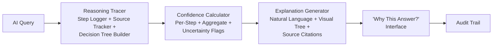

# 🧠 AI Legal Reasoning Transparency Engine — Show Your Work for AI Decisions


## The Problem

Legal AI is a black box — users don't know what sources were used, how conclusions were reached, or how confident the AI is. This destroys trust and creates liability. When a judge asks "how did you arrive at this recommendation?" and the answer is "the AI said so," that's not good enough.

## The Solution

A transparency layer that displays sources used, reasoning steps, confidence levels, and a "Why this answer?" interface. Makes AI explainable, auditable, and trustworthy for legal use. Every claim is traced to a source, every step is logged, and every conclusion comes with a confidence score.



## Who This Helps

- **Judges evaluating AI-assisted filings** — verify the reasoning behind AI-generated arguments
- **Attorneys verifying AI research** — trace every claim back to primary sources
- **Legal aid quality assurance** — ensure AI recommendations meet professional standards
- **Policymakers setting AI standards** — reference implementation for transparency requirements
- **Users needing to trust AI output** — understand why the AI recommended a specific action

## Features

- **Step-by-step reasoning trace** — every inference logged with source and method
- **Source attribution for every claim** — no unsourced statements allowed
- **Confidence scores per reasoning step** — know where the AI is certain and where it guesses
- **"Why this answer?" natural language explanations** — one-click explanations for any conclusion
- **Visual decision tree** — see the full reasoning path as an interactive diagram
- **Comparison of alternative conclusions** — understand what other answers were considered
- **Complete audit trail for compliance** — immutable record of every AI decision

## Quick Start

```bash
npm install @justice-os/reasoning-engine
```

```typescript
import {
  ReasoningTracer,
  ConfidenceCalculator,
  ExplanationGenerator,
  AuditTrail
} from '@justice-os/reasoning-engine';

// 1. Trace an AI reasoning process
const tracer = new ReasoningTracer();
const trace = tracer.startTrace('custody-recommendation');

tracer.addStep(trace.id, {
  description: 'Identify relevant custody factors',
  sources: [
    { id: 'statute_1', title: 'Family Code Section 3011', type: 'statute' },
    { id: 'case_1', title: 'In re Marriage of Brown', type: 'case_law' }
  ],
  method: 'source_analysis',
  result: 'Identified 5 statutory factors for custody determination'
});

tracer.addStep(trace.id, {
  description: 'Analyze parenting time allocation',
  sources: [
    { id: 'study_1', title: 'Joint Custody Outcomes Study 2024', type: 'research' }
  ],
  method: 'comparative_analysis',
  result: 'Research supports graduated parenting time approach'
});

// 2. Calculate confidence
const confidence = new ConfidenceCalculator();
const scores = confidence.calculate(trace);
console.log(`Overall confidence: ${scores.aggregate}%`);
console.log(`Uncertain areas: ${scores.uncertainAreas.join(', ')}`);

// 3. Generate explanation
const explainer = new ExplanationGenerator();
const explanation = explainer.explain(trace, scores);
console.log(explanation.summary);
// → "Based on Family Code Section 3011 and recent research on custody outcomes,
//    a graduated parenting time approach is recommended (confidence: 82%)."

// 4. Record audit trail
const audit = new AuditTrail();
audit.record(trace, scores, explanation);
```

## Roadmap

| Phase | Milestone | Status |
|-------|-----------|--------|
| 1 | Core reasoning tracer with step logging | In Progress |
| 2 | Source tracking and attribution engine | Planned |
| 3 | Confidence calculator with uncertainty flags | Planned |
| 4 | Natural language explanation generator | Planned |
| 5 | Visual decision tree component | Planned |
| 6 | Alternative conclusion comparison | Future |
| 7 | Immutable audit trail with compliance reports | Future |

---

## Justice OS Ecosystem

This repository is part of the **Justice OS** open-source ecosystem — 32 interconnected projects building the infrastructure for accessible justice technology.

### Core System Layer
| Repository | Description |
|-----------|-------------|
| [justice-os](https://github.com/dougdevitre/justice-os) | Core modular platform — the foundation |
| [justice-api-gateway](https://github.com/dougdevitre/justice-api-gateway) | Interoperability layer for courts |
| [legal-identity-layer](https://github.com/dougdevitre/legal-identity-layer) | Universal legal identity and auth |
| [case-continuity-engine](https://github.com/dougdevitre/case-continuity-engine) | Never lose case history across systems |
| [offline-justice-sync](https://github.com/dougdevitre/offline-justice-sync) | Works without internet — local-first sync |

### User Experience Layer
| Repository | Description |
|-----------|-------------|
| [justice-navigator](https://github.com/dougdevitre/justice-navigator) | Google Maps for legal problems |
| [mobile-court-access](https://github.com/dougdevitre/mobile-court-access) | Mobile-first court access kit |
| [cognitive-load-ui](https://github.com/dougdevitre/cognitive-load-ui) | Design system for stressed users |
| [multilingual-justice](https://github.com/dougdevitre/multilingual-justice) | Real-time legal translation |
| [voice-legal-interface](https://github.com/dougdevitre/voice-legal-interface) | Justice without reading or typing |
| [legal-plain-language](https://github.com/dougdevitre/legal-plain-language) | Turn legalese into human language |

### AI + Intelligence Layer
| Repository | Description |
|-----------|-------------|
| [vetted-legal-ai](https://github.com/dougdevitre/vetted-legal-ai) | RAG engine with citation validation |
| [justice-knowledge-graph](https://github.com/dougdevitre/justice-knowledge-graph) | Open data layer for laws and procedures |
| [legal-ai-guardrails](https://github.com/dougdevitre/legal-ai-guardrails) | AI safety SDK for justice use |
| [emotional-intelligence-ai](https://github.com/dougdevitre/emotional-intelligence-ai) | Reduce conflict, improve outcomes |
| [ai-reasoning-engine](https://github.com/dougdevitre/ai-reasoning-engine) | Show your work for AI decisions |

### Infrastructure + Trust Layer
| Repository | Description |
|-----------|-------------|
| [evidence-vault](https://github.com/dougdevitre/evidence-vault) | Privacy-first secure evidence storage |
| [court-notification-engine](https://github.com/dougdevitre/court-notification-engine) | Smart deadline and hearing alerts |
| [justice-analytics](https://github.com/dougdevitre/justice-analytics) | Bias detection and disparity dashboards |
| [evidence-timeline](https://github.com/dougdevitre/evidence-timeline) | Evidence timeline builder |

### Tools + Automation Layer
| Repository | Description |
|-----------|-------------|
| [court-doc-engine](https://github.com/dougdevitre/court-doc-engine) | TurboTax for legal filings |
| [justice-workflow-engine](https://github.com/dougdevitre/justice-workflow-engine) | Zapier for legal processes |
| [pro-se-toolkit](https://github.com/dougdevitre/pro-se-toolkit) | Self-represented litigant tools |
| [justice-score-engine](https://github.com/dougdevitre/justice-score-engine) | Access-to-justice measurement |
| [justice-app-generator](https://github.com/dougdevitre/justice-app-generator) | No-code builder for justice tools |

### Quality + Testing Layer
| Repository | Description |
|-----------|-------------|
| [justice-persona-simulator](https://github.com/dougdevitre/justice-persona-simulator) | Test products against real human realities |
| [justice-experiment-lab](https://github.com/dougdevitre/justice-experiment-lab) | A/B testing for justice outcomes |

### Adoption Layer
| Repository | Description |
|-----------|-------------|
| [digital-literacy-sim](https://github.com/dougdevitre/digital-literacy-sim) | Digital literacy simulator |
| [legal-resource-discovery](https://github.com/dougdevitre/legal-resource-discovery) | Find the right help instantly |
| [court-simulation-sandbox](https://github.com/dougdevitre/court-simulation-sandbox) | Practice before the real thing |
| [justice-components](https://github.com/dougdevitre/justice-components) | Reusable component library |
| [justice-dev-starter-kit](https://github.com/dougdevitre/justice-dev-starter-kit) | Ultimate boilerplate for justice tech builders |

> Built with purpose. Open by design. Justice for all.
