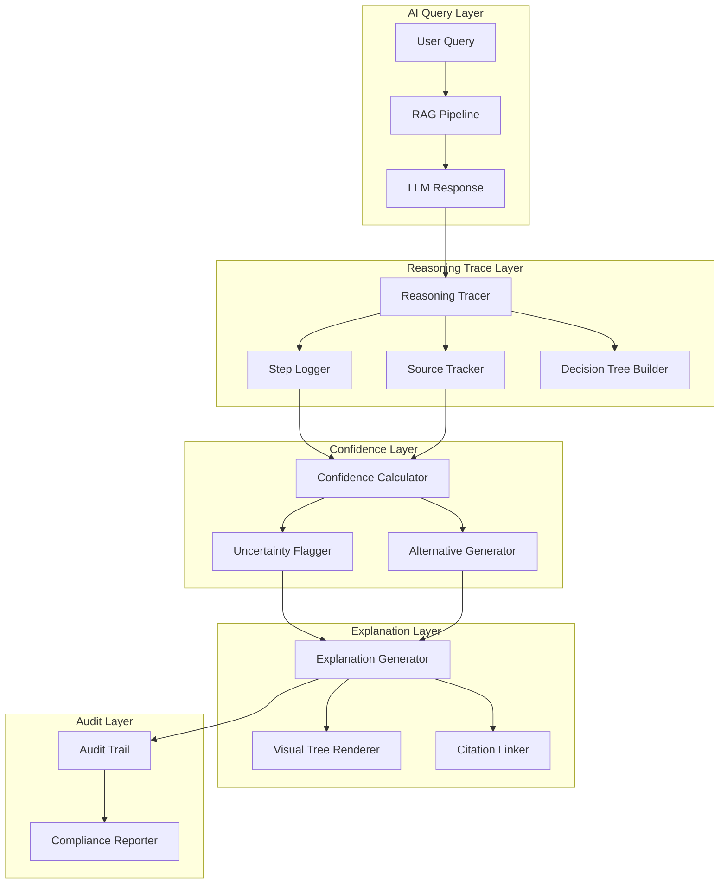
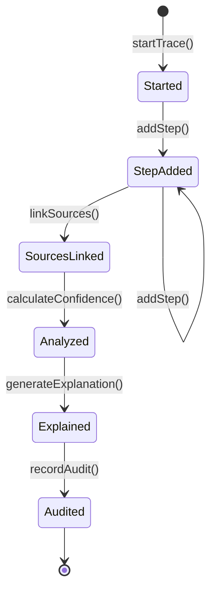
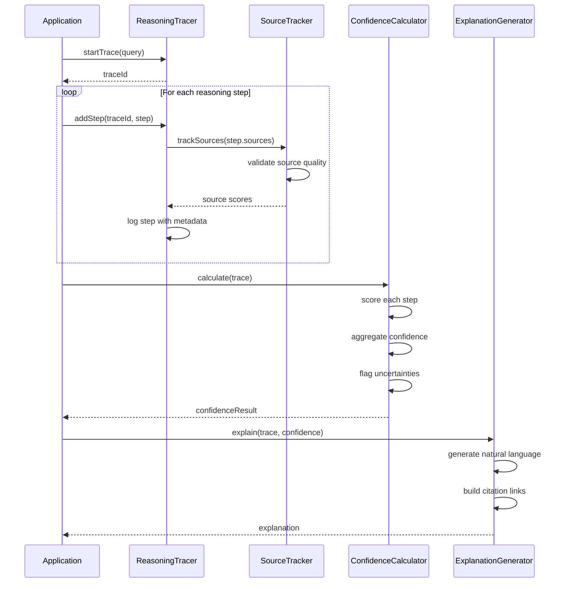
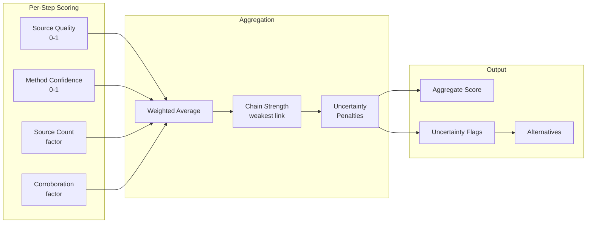
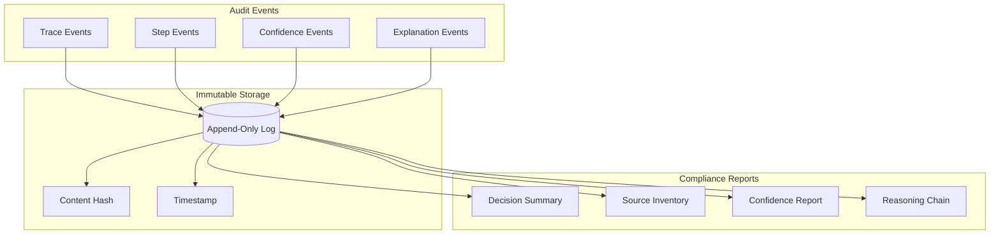

# Architecture — AI Reasoning Engine

## System Overview

```mermaid
flowchart TB
    subgraph Input["AI Query Layer"]
        Query[User Query]
        RAG[RAG Pipeline]
        LLM[LLM Response]
    end

    subgraph Tracing["Reasoning Trace Layer"]
        RT[Reasoning Tracer]
        SL[Step Logger]
        ST[Source Tracker]
        DTB[Decision Tree Builder]
    end

    subgraph Confidence["Confidence Layer"]
        CC[Confidence Calculator]
        UF[Uncertainty Flagger]
        AG[Alternative Generator]
    end

    subgraph Explanation["Explanation Layer"]
        EG[Explanation Generator]
        VT[Visual Tree Renderer]
        CL[Citation Linker]
    end

    subgraph Audit["Audit Layer"]
        AT[Audit Trail]
        CR[Compliance Reporter]
    end

    Query --> RAG --> LLM
    LLM --> RT
    RT --> SL
    RT --> ST
    RT --> DTB
    SL --> CC
    ST --> CC
    CC --> UF
    CC --> AG
    UF --> EG
    AG --> EG
    EG --> VT
    EG --> CL
    EG --> AT
    AT --> CR
```

## Reasoning Trace Lifecycle

```mermaid
stateDiagram-v2
    [*] --> Started: startTrace()
    Started --> StepAdded: addStep()
    StepAdded --> StepAdded: addStep()
    StepAdded --> SourcesLinked: linkSources()
    SourcesLinked --> Analyzed: calculateConfidence()
    Analyzed --> Explained: generateExplanation()
    Explained --> Audited: recordAudit()
    Audited --> [*]
```

## Reasoning Step Processing

```mermaid
sequenceDiagram
    participant App as Application
    participant RT as ReasoningTracer
    participant ST as SourceTracker
    participant CC as ConfidenceCalculator
    participant EG as ExplanationGenerator

    App->>RT: startTrace(query)
    RT-->>App: traceId

    loop For each reasoning step
        App->>RT: addStep(traceId, step)
        RT->>ST: trackSources(step.sources)
        ST->>ST: validate source quality
        ST-->>RT: source scores
        RT->>RT: log step with metadata
    end

    App->>CC: calculate(trace)
    CC->>CC: score each step
    CC->>CC: aggregate confidence
    CC->>CC: flag uncertainties
    CC-->>App: confidenceResult

    App->>EG: explain(trace, confidence)
    EG->>EG: generate natural language
    EG->>EG: build citation links
    EG-->>App: explanation
```

## Confidence Scoring Pipeline

```mermaid
flowchart LR
    subgraph StepScoring["Per-Step Scoring"]
        SQ[Source Quality<br/>0-1]
        MC[Method Confidence<br/>0-1]
        SC[Source Count<br/>factor]
        CR[Corroboration<br/>factor]
    end

    subgraph Aggregation["Aggregation"]
        WA[Weighted Average]
        Chain[Chain Strength<br/>weakest link]
        Penalty[Uncertainty<br/>Penalties]
    end

    subgraph Output["Output"]
        Score[Aggregate Score]
        Flags[Uncertainty Flags]
        Alts[Alternatives]
    end

    SQ --> WA
    MC --> WA
    SC --> WA
    CR --> WA
    WA --> Chain
    Chain --> Penalty
    Penalty --> Score
    Penalty --> Flags
    Flags --> Alts
```

## Audit Trail Architecture

```mermaid
flowchart TB
    subgraph Events["Audit Events"]
        TE[Trace Events]
        SE[Step Events]
        CE[Confidence Events]
        EE[Explanation Events]
    end

    subgraph Storage["Immutable Storage"]
        Log[(Append-Only Log)]
        Hash[Content Hash]
        TS[Timestamp]
    end

    subgraph Reports["Compliance Reports"]
        Summary[Decision Summary]
        Sources[Source Inventory]
        Confidence[Confidence Report]
        Chain[Reasoning Chain]
    end

    TE --> Log
    SE --> Log
    CE --> Log
    EE --> Log
    Log --> Hash
    Log --> TS
    Log --> Summary
    Log --> Sources
    Log --> Confidence
    Log --> Chain
```
