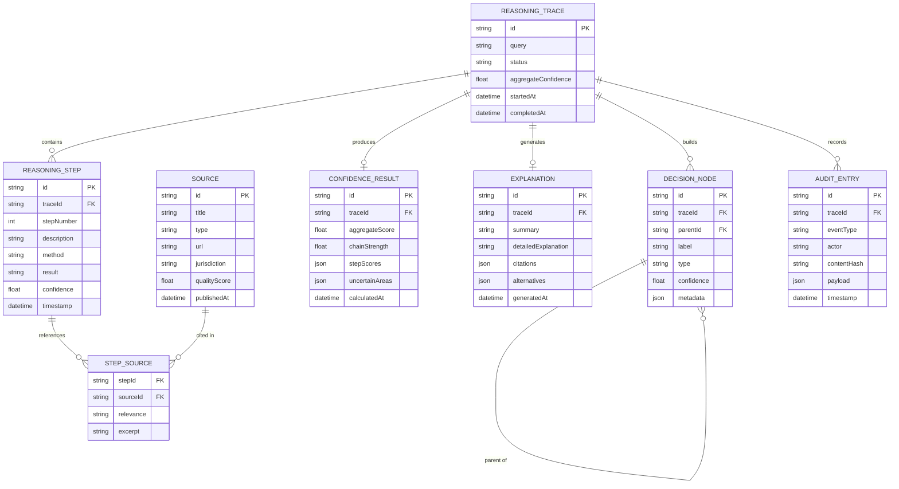

# Data Model — AI Reasoning Engine

## Entity Relationship Diagram

```mermaid
erDiagram
    REASONING_TRACE {
        string id PK
        string query
        string status
        float aggregateConfidence
        datetime startedAt
        datetime completedAt
    }

    REASONING_STEP {
        string id PK
        string traceId FK
        int stepNumber
        string description
        string method
        string result
        float confidence
        datetime timestamp
    }

    SOURCE {
        string id PK
        string title
        string type
        string url
        string jurisdiction
        float qualityScore
        datetime publishedAt
    }

    STEP_SOURCE {
        string stepId FK
        string sourceId FK
        string relevance
        string excerpt
    }

    CONFIDENCE_RESULT {
        string id PK
        string traceId FK
        float aggregateScore
        float chainStrength
        json stepScores
        json uncertainAreas
        datetime calculatedAt
    }

    EXPLANATION {
        string id PK
        string traceId FK
        string summary
        string detailedExplanation
        json citations
        json alternatives
        datetime generatedAt
    }

    DECISION_NODE {
        string id PK
        string traceId FK
        string parentId FK
        string label
        string type
        float confidence
        json metadata
    }

    AUDIT_ENTRY {
        string id PK
        string traceId FK
        string eventType
        string actor
        string contentHash
        json payload
        datetime timestamp
    }

    REASONING_TRACE ||--o{ REASONING_STEP : "contains"
    REASONING_TRACE ||--o| CONFIDENCE_RESULT : "produces"
    REASONING_TRACE ||--o| EXPLANATION : "generates"
    REASONING_TRACE ||--o{ DECISION_NODE : "builds"
    REASONING_TRACE ||--o{ AUDIT_ENTRY : "records"
    REASONING_STEP ||--o{ STEP_SOURCE : "references"
    SOURCE ||--o{ STEP_SOURCE : "cited in"
    DECISION_NODE ||--o{ DECISION_NODE : "parent of"
```
